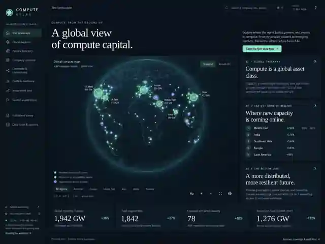
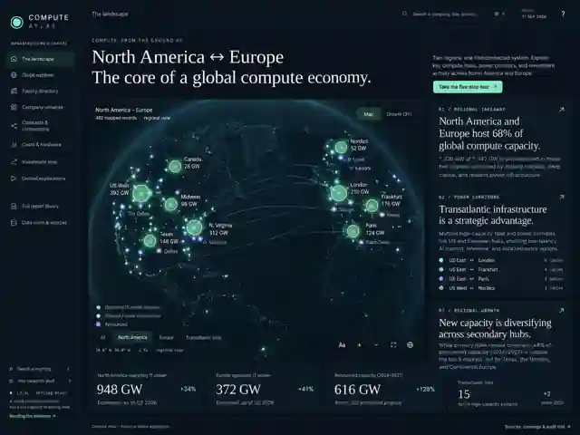
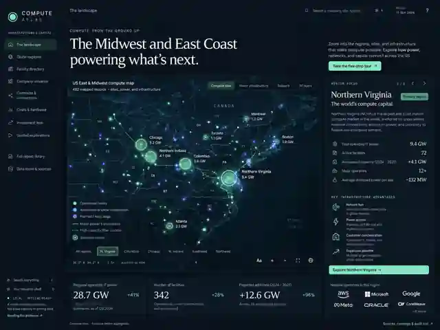
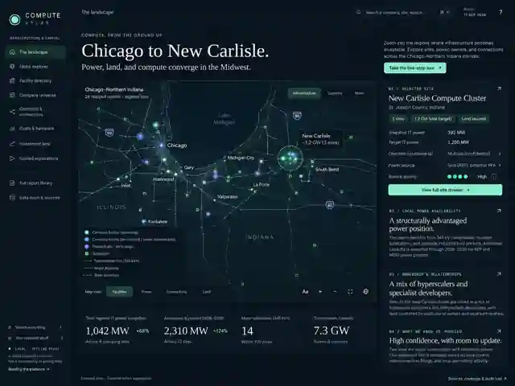
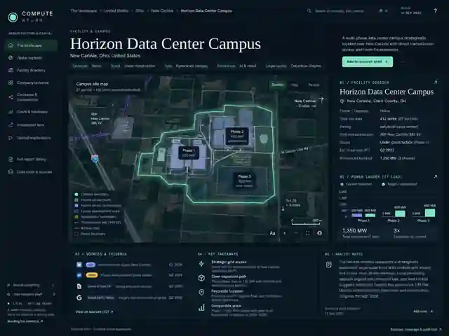
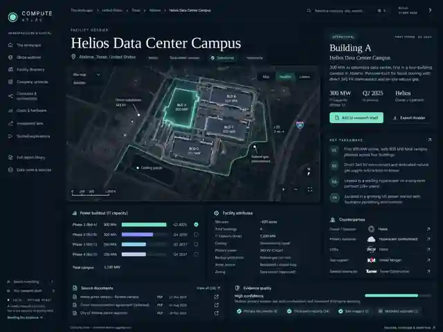

# Approved Compute Atlas visual references

These six user-supplied reference images are **visual-design references only**.
All numbers, names, dates, roads, parcels, substations, transmission/fiber lines,
building footprints, cooling equipment, corporate roles and capacities in these
images require independent evidence before they can appear as facts in the app.
In particular, “Horizon” and the mockup's “Helios” labels do not establish a real
project, location or ownership relationship. Unknown is not zero.

These are compressed review copies of the originals supplied in the conversation.
Do not use them as a basemap, satellite layer or dataset. Missing exact geometry
must be an explicitly labeled evidence schematic or approximate geographic context.

Implementation tracking: [Issue #2](https://github.com/Untitled1-Agent/compute-atlas/issues/2).
Initial semantic shell: [PR #3](https://github.com/Untitled1-Agent/compute-atlas/pull/3).
Cartographic implementation: [PR #6](https://github.com/Untitled1-Agent/compute-atlas/pull/6).

## 01 — World
Editorial headline, globe hero, luminous clusters, analysis rail and four bottom KPIs.

## 02 — Continent
Closer regional-system framing, legible cluster labels and regional evidence.
Connections must be independently sourced, not decorative “infrastructure.”

## 03 — Region
Geographic context, selected hubs, locally scoped metrics and source-aware operators.

## 04 — Metro / corridor
Individual facilities, local context, ownership roles and visible evidence boundaries.

## 05 — Campus
Project phases, power ladder, sources and notes. Parcel-like shapes here are illustrative.

## 06 — Facility
Source-level detail, counterparties, dated phase facts and explicit evidence quality.

## Screenshot comparison

Run `python qa/zoom-explorer.py` and inspect `qa/screenshots/`. Compare all six
scales at desktop width and the world/facility screens at mobile width. Verify
layout, typography, hierarchy, label collisions, visible uncertainty, focus states,
and interactive behavior. A QA count is not a visual-fidelity certificate.
